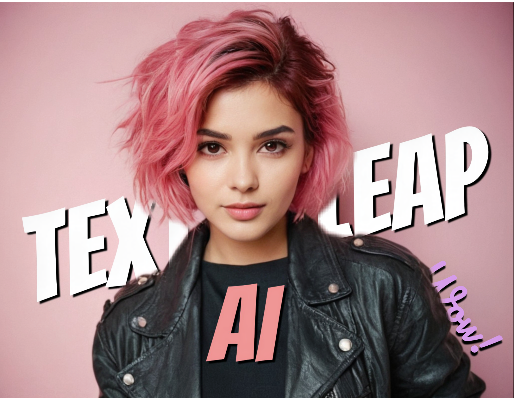

<h1 align="center">Hi there!👋 I'm Pramod</h1>

  

<h3>🙋‍♂️ About me</h3>
🌟<strong>LinkedIn Top AI Voice | Top Machine Learning voice</strong>🌟
 
With a Bachelor of Engineering in Computer Science and Engineering, I bring an extensive wealth of expertise in Data Science, Artificial Intelligence & Machine Learning, with knowledge in Transformers and Large Language Models (LLMs). My passion for technology has been a driving force throughout my journey, fueled by a profound fascination with the extraordinary capabilities of Neural Networks and their applications. With a commitment to innovation, I am dedicated to exploring and contributing to the dynamic landscape of AI, particularly in the development and optimization of Transformer architectures. I am especially interested in Generative AI and the advancement of LLMs, where I seek to push the boundaries of what is achievable in this rapidly evolving field.

<!-- START NEW SECTION -->
<h3>📱 Check out my small app, launched recently</h3>

  
   
  

<h4>I'm looking to collaborate on Open-Source AI Projects </h4>

<!-- START NEW SECTION -->
 <!-- CONNECT WITH ME LINKS -->
<h3><a id="user-content-about-me" class="anchor" aria-hidden="true" href="#about-me"><svg class="octicon octicon-link" viewBox="0 0 16 16" version="1.1" width="16" height="16" aria-hidden="true"></a>📫 Connect with me</h3>

  <!--
  
-->

    

<!-- START NEW SECTION -->

    
  <h2 align="center">Some of my 🏆🫰</h2>

<!-- START NEW SECTION -->

 <!--<h2 align="center">My Github Stats</h2>
 -->
<!--
|My languages|Streaks|
|-|-|
||

-->

<!--|
-->
<!-- START NEW SECTION -->

  
 
<b> Here is a random joke that'll make you laugh!</b>

 

 

 </samp>

 Refresh page to load New joke

 
  

<!--

-->

